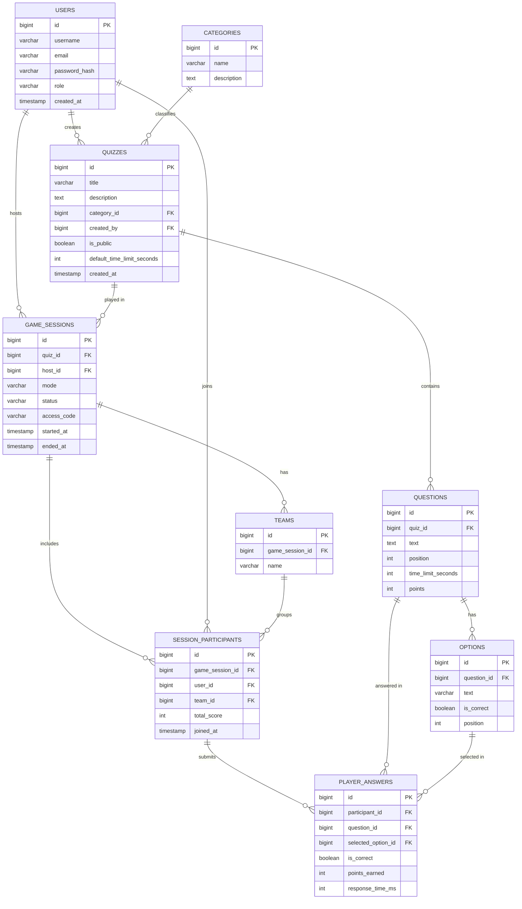

# Esquema Inicial da Base de Dados

## Visão Geral

Este documento define o esquema inicial da base de dados PostgreSQL do **Quiz Game Platform**, alinhado com as funcionalidades descritas no [README](../README.md) e com a stack definida em [architecture.md](architecture.md) (Spring Boot + Spring Data JPA + Hibernate + PostgreSQL).

As entidades cobrem as seguintes funcionalidades do produto:

- Registo e login de utilizadores (`users`)
- Criação e gestão de quizzes (`quizzes`, `categories`)
- Perguntas com múltiplas opções (`questions`, `options`)
- Gameplay interativo, temporizador e modo equipa (`game_sessions`, `teams`, `session_participants`)
- Sistema de pontuação, resultados finais e histórico de partidas (`player_answers`, campos de score em `session_participants`)
- Leaderboard (derivada por query, não é uma tabela própria — ver [Notas de Design](#notas-de-design))

## Entidades Principais

### `users`

Contas de utilizador (jogadores e administradores).

| Coluna          | Tipo         | Constraints                          |
|-----------------|--------------|---------------------------------------|
| id              | BIGSERIAL    | PK                                    |
| username        | VARCHAR(50)  | UNIQUE, NOT NULL                      |
| email           | VARCHAR(150) | UNIQUE, NOT NULL                      |
| password_hash   | VARCHAR(255) | NOT NULL                              |
| role            | VARCHAR(20)  | NOT NULL, DEFAULT `'PLAYER'` (`PLAYER`, `ADMIN`) |
| created_at      | TIMESTAMP    | NOT NULL, DEFAULT `now()`             |
| updated_at      | TIMESTAMP    | NULLABLE                              |

### `categories`

Categorias opcionais para organizar quizzes (ex.: Ciência, Desporto, História).

| Coluna      | Tipo          | Constraints        |
|-------------|---------------|---------------------|
| id          | BIGSERIAL     | PK                  |
| name        | VARCHAR(100)  | UNIQUE, NOT NULL    |
| description | TEXT          | NULLABLE            |

### `quizzes`

Um quiz criado por um utilizador, composto por várias perguntas.

| Coluna                     | Tipo         | Constraints                                  |
|----------------------------|--------------|-----------------------------------------------|
| id                         | BIGSERIAL    | PK                                            |
| title                      | VARCHAR(150) | NOT NULL                                      |
| description                | TEXT         | NULLABLE                                      |
| category_id                | BIGINT       | FK → `categories.id`, NULLABLE                |
| created_by                 | BIGINT       | FK → `users.id`, NOT NULL                     |
| is_public                  | BOOLEAN      | NOT NULL, DEFAULT `true`                      |
| default_time_limit_seconds | INTEGER      | NOT NULL, DEFAULT `30`                        |
| created_at                 | TIMESTAMP    | NOT NULL, DEFAULT `now()`                     |
| updated_at                 | TIMESTAMP    | NULLABLE                                      |

### `questions`

Perguntas pertencentes a um quiz.

| Coluna              | Tipo      | Constraints                              |
|---------------------|-----------|--------------------------------------------|
| id                  | BIGSERIAL | PK                                        |
| quiz_id             | BIGINT    | FK → `quizzes.id`, NOT NULL               |
| text                | TEXT      | NOT NULL                                  |
| position            | INTEGER   | NOT NULL (ordem dentro do quiz)           |
| time_limit_seconds  | INTEGER   | NULLABLE (substitui o valor por defeito do quiz) |
| points              | INTEGER   | NOT NULL, DEFAULT `100`                   |
| created_at          | TIMESTAMP | NOT NULL, DEFAULT `now()`                 |

`UNIQUE (quiz_id, position)`

### `options`

Opções de resposta de uma pergunta de escolha múltipla.

| Coluna       | Tipo         | Constraints                        |
|--------------|--------------|--------------------------------------|
| id           | BIGSERIAL    | PK                                  |
| question_id  | BIGINT       | FK → `questions.id`, NOT NULL       |
| text         | VARCHAR(255) | NOT NULL                            |
| is_correct   | BOOLEAN      | NOT NULL, DEFAULT `false`           |
| position     | INTEGER      | NOT NULL                            |

`UNIQUE (question_id, position)`. A regra "exatamente uma opção correta por pergunta" é validada na camada de serviço (não é uma constraint de base de dados).

### `game_sessions`

Uma partida (execução) de um quiz — solo ou em equipa.

| Coluna       | Tipo         | Constraints                                                |
|--------------|--------------|--------------------------------------------------------------|
| id           | BIGSERIAL    | PK                                                          |
| quiz_id      | BIGINT       | FK → `quizzes.id`, NOT NULL                                 |
| host_id      | BIGINT       | FK → `users.id`, NOT NULL                                   |
| mode         | VARCHAR(10)  | NOT NULL, DEFAULT `'SOLO'` (`SOLO`, `TEAM`)                  |
| status       | VARCHAR(20)  | NOT NULL, DEFAULT `'WAITING'` (`WAITING`, `IN_PROGRESS`, `FINISHED`) |
| access_code  | VARCHAR(10)  | UNIQUE, NOT NULL (código para outros jogadores entrarem)     |
| started_at   | TIMESTAMP    | NULLABLE                                                    |
| ended_at     | TIMESTAMP    | NULLABLE                                                    |
| created_at   | TIMESTAMP    | NOT NULL, DEFAULT `now()`                                    |

### `teams`

Equipas dentro de uma partida (apenas relevante quando `game_sessions.mode = 'TEAM'`).

| Coluna          | Tipo        | Constraints                            |
|-----------------|-------------|------------------------------------------|
| id              | BIGSERIAL   | PK                                      |
| game_session_id | BIGINT      | FK → `game_sessions.id`, NOT NULL       |
| name            | VARCHAR(50) | NOT NULL                                |

`UNIQUE (game_session_id, name)`

### `session_participants`

Associação entre um utilizador e uma partida (jogador dentro de uma `game_session`).

| Coluna          | Tipo      | Constraints                                       |
|-----------------|-----------|------------------------------------------------------|
| id              | BIGSERIAL | PK                                                  |
| game_session_id | BIGINT    | FK → `game_sessions.id`, NOT NULL                   |
| user_id         | BIGINT    | FK → `users.id`, NOT NULL                           |
| team_id         | BIGINT    | FK → `teams.id`, NULLABLE                           |
| total_score     | INTEGER   | NOT NULL, DEFAULT `0` (agregado, atualizado a cada resposta) |
| joined_at       | TIMESTAMP | NOT NULL, DEFAULT `now()`                            |

`UNIQUE (game_session_id, user_id)` — um utilizador só pode entrar uma vez na mesma partida.

### `player_answers`

Resposta submetida por um participante a uma pergunta específica.

| Coluna              | Tipo      | Constraints                                          |
|---------------------|-----------|---------------------------------------------------------|
| id                  | BIGSERIAL | PK                                                     |
| participant_id      | BIGINT    | FK → `session_participants.id`, NOT NULL               |
| question_id         | BIGINT    | FK → `questions.id`, NOT NULL                          |
| selected_option_id  | BIGINT    | FK → `options.id`, NULLABLE (`NULL` = sem resposta / tempo esgotado) |
| is_correct          | BOOLEAN   | NOT NULL, DEFAULT `false`                              |
| points_earned       | INTEGER   | NOT NULL, DEFAULT `0`                                  |
| response_time_ms    | INTEGER   | NULLABLE                                               |
| answered_at         | TIMESTAMP | NOT NULL, DEFAULT `now()`                               |

`UNIQUE (participant_id, question_id)` — uma resposta por pergunta por participante.

## Relacionamentos

| Relação                                        | Cardinalidade |
|-------------------------------------------------|----------------|
| `users` → `quizzes` (criador)                    | 1 : N          |
| `categories` → `quizzes`                         | 1 : N (opcional) |
| `quizzes` → `questions`                          | 1 : N          |
| `questions` → `options`                          | 1 : N          |
| `users` → `game_sessions` (host)                 | 1 : N          |
| `quizzes` → `game_sessions`                      | 1 : N          |
| `game_sessions` → `teams`                        | 1 : N          |
| `game_sessions` → `session_participants`         | 1 : N          |
| `users` → `session_participants`                 | 1 : N          |
| `teams` → `session_participants`                 | 1 : N (opcional) |
| `session_participants` → `player_answers`        | 1 : N          |
| `questions` → `player_answers`                   | 1 : N          |
| `options` → `player_answers` (opção selecionada) | 1 : N (opcional) |

## ERD

## Notas de Design

- **Leaderboard**: não é uma tabela própria. É derivada com uma query sobre `session_participants.total_score` (leaderboard de uma partida) ou agregando `player_answers`/`session_participants` por `user_id` (leaderboard global). Evita duplicar dados que já existem noutras tabelas.
- **Histórico de partidas**: satisfeito pela relação `users` → `session_participants` → `game_sessions`; não precisa de entidade dedicada.
- **Modo equipa**: `teams` está associada a uma `game_session` específica (equipas ad-hoc por partida), não são equipas persistentes entre partidas. Se no futuro for necessário equipas persistentes, `teams` passaria a ter uma FK opcional para uma entidade `permanent_teams`.
- **Roles**: usa-se uma coluna `role` simples em `users` (em vez de uma tabela `roles` + tabela de junção) porque o âmbito inicial só precisa de `PLAYER`/`ADMIN`. Pode evoluir para uma tabela `roles` se surgirem permissões mais granulares.
- **Mapeamento para JPA**: nomes de tabelas/colunas em `snake_case`; as entidades Java devem usar `camelCase` (ex.: `passwordHash`, `createdBy`) com `@Column(name = "...")` conforme convenção do Hibernate. Relações `1:N` mapeiam-se com `@OneToMany`/`@ManyToOne`.
- **Timestamps**: `created_at`/`updated_at` podem ser geridos automaticamente com `@CreationTimestamp`/`@UpdateTimestamp` do Hibernate.

## Próximos Passos

- Rever esta proposta em equipa (branch `feature/database-setup`).
- Após aprovação, criar as entidades JPA em `backend/src/main/java/.../model/`.
- Confirmar se `Hibernate DDL auto` (`spring.jpa.hibernate.ddl-auto`) será usado em desenvolvimento ou se serão criadas migrations versionadas (ex.: Flyway/Liquibase) antes de produção.
